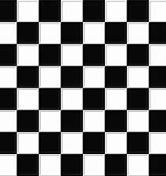
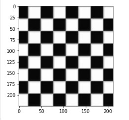
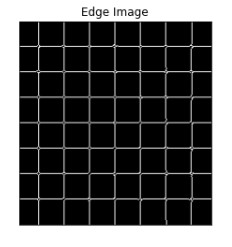
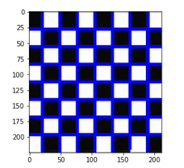

# Edge-Linking-using-Hough-Transform
# AIM:
To write a Python program to detect the lines using Hough Transform.

# SOFTWARE REQUIRED:
Anaconda - Python 3.7

# ALGORITHM:
## Step 1:
Import the neccessary packages such as cv2,numpy,matplotlib for the program.


## Step 2:
Read the image and convert the image to greyscale image.

## Step 3:
Find the edges using canny edge detector.


## Step 4:
Detect the points from the line.


## Step 5:
Draw the lines on the image.

## Step 6:
Display the final output image.


# PROGRAM:
```
Program developed by: R.SOMEASVAR
Register number: 212221230103
```


## Read image and convert it to grayscale image:
```
import cv2
import numpy as np
import matplotlib.pyplot as plt
BGR_image=cv2.imread('chess.jpg')
gray=cv2.cvtColor(BGR_image,cv2.COLOR_BGR2GRAY)
Image= cv2.GaussianBlur(BGR_image,(3,3),0)
plt.imshow(Image)
```


## Find the edges in the image using canny detector and display:
```
edges1 = cv2.Canny(Image,100,200)
plt.imshow(edges1,cmap = 'gray')
plt.title('Edge Image'), plt.xticks([]), plt.yticks([])
plt.show()
```


## Detect points that form a line using HoughLinesP:
```
lines=cv2.HoughLinesP(edges1,1,np.pi/180, threshold=80, minLineLength=50,maxLineGap=250)
```


## Draw lines on the image:
```
for line in lines:
    x1, y1, x2, y2 = line [0] 
    cv2.line(BGR_image,(x1, y1),(x2, y2),(0, 0, 255),3)
```


## Display the result:
```
plt.imshow(BGR_image)
```


# OUTPUT:
## Original image:


## Grayscale image:



## Canny Edge detector output



## Display the result of Hough transform



# RESULT:
Thus the program is written with python and OpenCV to detect lines using Hough transform. 
